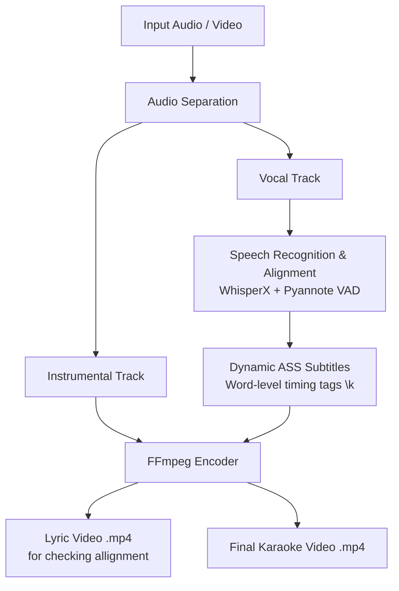

# 🎤 Karaoke Maker

An automated end-to-end Python pipeline that converts audio/video files into fully synchronized karaoke videos with styled subtitles, word-level highlight timing, and isolated instrumental backing tracks. It uses WhisperX AI voice activity detection.

---

## 📌 Features

- **Vocal & Instrumental Separation**: Automatically isolates background music (instrumentals) and vocals using audio source separation.
- **Speech-to-Text Alignment**: Generates word-level timestamps using WhisperX and Pyannote Voice Activity Detection (VAD).
- **Karaoke Subtitle Generation (`.ass`)**: Outputs Advanced SubStation Alpha format with word-level highlight tags (`\k` / `\kf`) for dynamic text highlighting.
- **Automated Video Rendering**: Merges instrumental audio with customized karaoke subtitles into a finished MP4 video using `ffmpeg`.

---

## ⚙️ Architecture & Pipeline Overview


---

## 🛠️ Requirements & Dependencies

### System Requirements
- **Python**: 3.9+
- **FFmpeg**: Must be installed and available in your system path (`PATH`).
- **CUDA / GPU Acceleration**: Recommended for faster WhisperX transcription and stem separation.

### Core Libraries
- [WhisperX](https://github.com/m-bain/whisperX) (Timestamp alignment & transcription)
- [PyTorch](https://pytorch.org/) (CUDA execution)
- [ffmpeg-python](https://github.com/kkroening/ffmpeg-python) / `ffmpeg` CLI

---

## 🚀 Quick Start & Usage

### 1. Installation

Clone the repository and install dependencies:

```bash
git clone [https://github.com/DanGitlarian/Karaoke_Maker.git](https://github.com/DanGitlarian/Karaoke_Maker.git)
cd Karaoke_Maker
pip install -r requirements.txt
```

### 2. Execution

Run the main pipeline on your input media file:

```bash
python main.py --input "path/to/song.mp3" --output_dir "./output"
```


🎨 Subtitle Customization

The .ass subtitle files are generated with customizable styling options:

    Font & Size: Modify typography for high legibility.

    Highlighting Effect: Uses \k / \kf karaoke timing codes for smooth syllable/word fills.

    Colors: Primary text color, outline, and highlight color configurations.

### 3. File Summary
File Summaries: Inputs, Outputs, and Options

#### main.py (Pipeline Orchestrator)

Role: The main entry point that chains together stem separation, speech alignment, subtitle generation, and video encoding.

Inputs: Raw audio/video file (e.g., .mp3, .wav, .mp4). Optional manual text file (lyrics.txt) or word timing JSON (vocals.json).

Outputs: Final rendered karaoke video (.mp4), standalone backing audio (.mp4/.wav), and formatted subtitle files (.ass).

Options / Arguments:

        --input: Path to input media file.

        --output_dir: Target directory for generated artifacts.

        --lyrics_file: Path to external lyrics text if skipping automatic transcription.

        --font_name / --font_size: Typography settings for subtitle overlays.

#### transcribe_align.py (WhisperX & VAD Engine)

Role: Extracts audio speech, runs voice activity detection via Pyannote VAD, and aligns words using WhisperX phoneme models.

Inputs: Vocal audio track extracted during stem separation (or direct audio file).

Outputs: Structured vocals.json file containing words, start times, end times, and confidence scores.

Options / Arguments:

        --model: Selects Whisper model size (e.g., tiny, base, medium, large-v2).

        --language: Specifies source language or enables auto-detection.

        --device: Hardware target (cuda vs. cpu).

#### ass_generator.py (Subtitle Stylist & Timing Calculator)

Role: Reads word-level alignment JSON, interpolates missing timestamps based on character counts, splits long lyric blocks, and computes \k / \kf highlight tags.

Inputs: vocals.json or processed word list + style configuration options.

Outputs: Styled .ass (Advanced SubStation Alpha) subtitle file.

Options / Arguments:

        --max_chars_per_line: Line-wrapping threshold to prevent on-screen overflow.

        --highlight_color: Primary fill color for active sung syllables.

        --outline_color / --back_color: Styling for text borders and shadow boxes.

#### video_builder.py (FFmpeg Encoding Wrapper)

Role: Takes the backing instrumental stem, overlays the styled .ass file, and encodes the final media file using FFmpeg.

Inputs: Instrumental audio track (.wav/.mp3), .ass subtitle file, background image/video asset.

Outputs: Final .mp4 karaoke video file.

Options / Arguments:

        --video_codec: Encoder selection (e.g., libx264, h264_nvenc).

        --resolution: Output video resolution (e.g., 1920x1080).

📄 License

Distributed under the MIT License. See LICENSE for more information.


