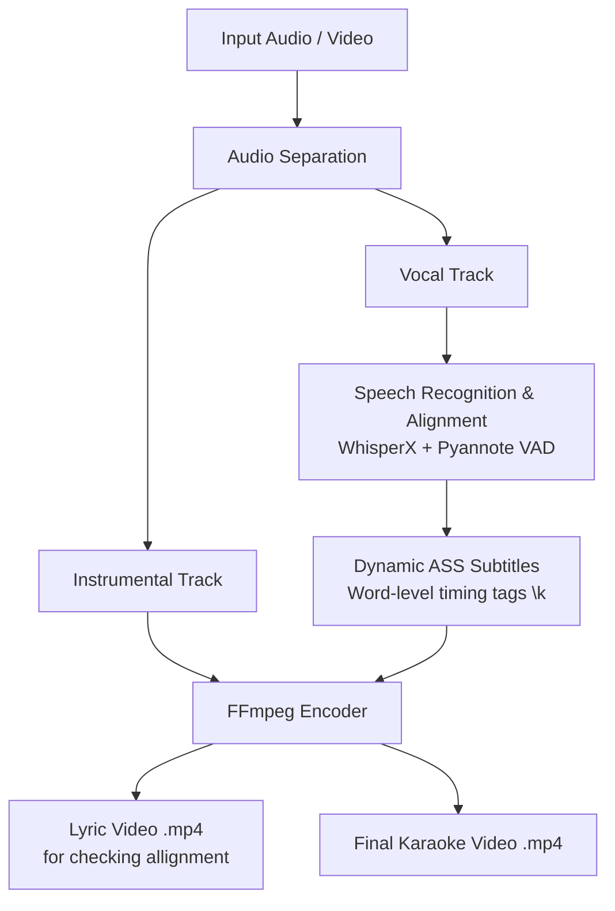

# 🎤 Karaoke Maker

An automated end-to-end Python pipeline that converts audio/video files into fully synchronized karaoke videos with styled subtitles, word-level highlight timing, and isolated instrumental backing tracks. It uses WhisperX AI voice activity detection.

---

## 📌 Features

- **Vocal & Instrumental Separation**: Automatically isolates background music (instrumentals) and vocals using audio source separation.
- **Speech-to-Text Alignment**: Generates word-level timestamps using WhisperX and Pyannote Voice Activity Detection (VAD).
- **Karaoke Subtitle Generation (`.ass`)**: Outputs Advanced SubStation Alpha format with word-level highlight tags (`\k` / `\kf`) for dynamic text highlighting.
- **Automated Video Rendering**: Merges instrumental audio with customized karaoke subtitles into a finished MP4 video using `ffmpeg`.

---

## ⚙️ Architecture & Pipeline Overview


---

## 🛠️ Requirements & Dependencies

### System Requirements
- **Python**: 3.9+
- **FFmpeg**: Must be installed and available in your system path (`PATH`).
- **CUDA / GPU Acceleration**: Recommended for faster WhisperX transcription and stem separation.

### Core Libraries
- [WhisperX](https://github.com/m-bain/whisperX) (Timestamp alignment & transcription)
- [PyTorch](https://pytorch.org/) (CUDA execution)
- [ffmpeg-python](https://github.com/kkroening/ffmpeg-python) / `ffmpeg` CLI

---

## 🚀 Quick Start & Usage

### 1. Installation

Clone the repository and install dependencies:

```bash
git clone [https://github.com/DanGitlarian/Karaoke_Maker.git](https://github.com/DanGitlarian/Karaoke_Maker.git)
cd Karaoke_Maker
pip install -r requirements.txt
```

### 2. Execution

Run the main pipeline on your input media file:

```bash
python main.py --input "path/to/song.mp3" --output_dir "./output"
```

🎨 Subtitle Customization

The .ass subtitle files are generated with customizable styling options:

    Font & Size: Modify typography for high legibility.

    Highlighting Effect: Uses \k / \kf karaoke timing codes for smooth syllable/word fills.

    Colors: Primary text color, outline, and highlight color configurations.

📄 License

Distributed under the MIT License. See LICENSE for more information.


