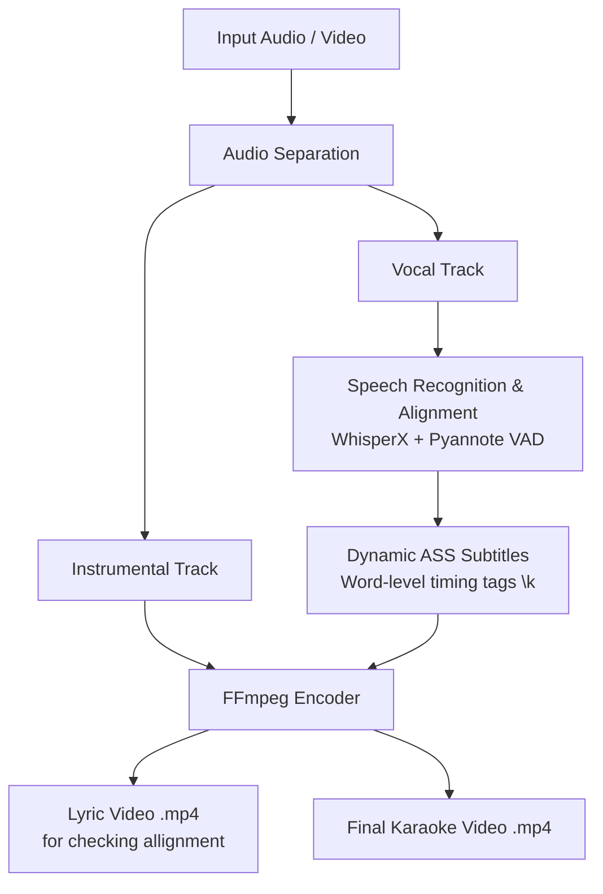

# 🎤 Karaoke Maker

An automated end-to-end Python pipeline that converts audio/video files into fully synchronized karaoke videos with styled subtitles, word-level highlight timing, and isolated instrumental backing tracks. It uses WhisperX AI voice activity detection.

---

## 📌 Features

- **Vocal & Instrumental Separation**: Automatically isolates background music (instrumentals) and vocals using audio source separation.
- **Speech-to-Text Alignment**: Generates word-level timestamps using WhisperX and Pyannote Voice Activity Detection (VAD).
- **Karaoke Subtitle Generation (`.ass`)**: Outputs Advanced SubStation Alpha format with word-level highlight tags (`\k` / `\kf`) for dynamic text highlighting.
- **Automated Video Rendering**: Merges instrumental audio with customized karaoke subtitles into a finished MP4 video using `ffmpeg`.

---

## ⚙️ Architecture & Pipeline Overview


---

## 🛠️ Requirements & Dependencies

### System Requirements
- **Python**: 3.9+
- **FFmpeg**: Must be installed and available in your system path (`PATH`).
- **CUDA / GPU Acceleration**: Recommended for faster WhisperX transcription and stem separation.

### Core Libraries
- [WhisperX](https://github.com/m-bain/whisperX) (Timestamp alignment & transcription)
- [PyTorch](https://pytorch.org/) (CUDA execution)
- [ffmpeg-python](https://github.com/kkroening/ffmpeg-python) / `ffmpeg` CLI

---

## 🚀 Quick Start & Usage

### 1. Installation

Clone the repository and install dependencies:

```bash
git clone [https://github.com/DanGitlarian/Karaoke_Maker.git](https://github.com/DanGitlarian/Karaoke_Maker.git)
cd Karaoke_Maker
pip install -r requirements.txt
```

### 2. Execution

Run the main pipeline on your input media file:

```bash
python main.py --input "path/to/song.mp3" --output_dir "./output"
```


🎨 Subtitle Customization

The .ass subtitle files are generated with customizable styling options:

    Font & Size: Modify typography for high legibility.

    Highlighting Effect: Uses \k / \kf karaoke timing codes for smooth syllable/word fills.

    Colors: Primary text color, outline, and highlight color configurations.

### 3. File Summary

#### preprocess_filenames.py
* **Input**: Files in `Songs\input`.


* **Output**: Renamed audio/video files with clean titles.


* **Options**: Strips common garbage tags like `(Official Music Video)`, spaces, or special characters to standardize folder names down the line.


#### separator.py (and the `vocal-separate` utility)
* **Input**: Raw song files in `Songs\input`.


* **Output**: Extracted vocal and instrumental stems moved into output folders.


* **Options**: Allows splitting tracks into isolated instrumental backing and isolated vocal audio tracks.


#### bulk_transcribe.py / transcribe_lyrics.py
* **Input**: Vocal track stem + optional reference text (`lyrics.txt`).


* **Output**: Raw timestamped `.json` transcript (containing word alignments).


* **Options**:
#### bulk_transcribe.py : Fully automatic Whisper speech-to-text.


#### transcribe_lyrics.py : Forced alignment (aligns a pre-provided lyric text file against the vocal audio).


#### lyric_syncer.py : Configurable for English or non-English Whisper modes.


#### organize_songs.py
* **Input**: Loose files, isolated audio stems, and generated `.json` alignments.


* **Output**: Structured per-song directory layout (e.g., `Songs/input/<song_name>/`).


* **Options**: Creates the required subfolder structure and expects `song_video.mp4` to be placed inside for final rendering.


#### generate_vocal_chunks.py
* **Input**: Unprocessed `.json` vocal timestamp file.


* **Output**: Segmented `vocal_chunks.json` (broken down by sentence/phrase boundaries).


* **Options**: Controls phrase splitting so lines don't run off the edge of the screen during playback.


#### chunks_to_karaoke.py / json_to_karaoke.py
* **Input**: Segmented JSON chunks or raw JSON word timestamps.


* **Output**: Styled `.ass` (Advanced SubStation Alpha) subtitle file with `\k` karaoke highlight timing tags.


* **Options**: Configures subtitle font styles, text colors (e.g., active highlight color), font size, and line position.


#### make_karaoke_videos.py / finalize_karaoke.py
* **Input**: Background video (`song_video.mp4`), `.ass` subtitle file, and instrumental audio stem.


* **Output**: Rendered `.mp4` karaoke video.

#### Options for finalization:
#### make_karaoke_videos.py : Mixes background video with karaoke subtitles while keeping original audio/vocals.


#### finalize_karaoke.py`: Renders the final video replacing original audio with the isolated **instrumental** track (vocal removal).


#### post_adjustment.bat 
* **Input**: Existing `.json` transcript files.
* **Output**: Updated `.ass` subtitles without re-running stem separation or Whisper transcription.
* **Options**: A quick editor/re-processor for manual tweaks after reviewing initial timestamps.


📄 License

Distributed under the MIT License. See LICENSE for more information.


